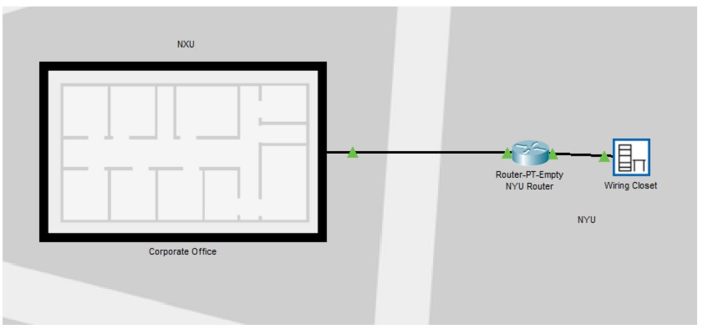

# CE3057-網路概論與實務 105503007 毛煥為 期末Project

## 專題名稱：模擬校園實驗室網路
## 服務目的：
* 模擬學校內單一系館樓層網路分布，樓層中有數間實驗室。
* 一個校區中有獨立DNS和郵件伺服器。
* 獨立建立Recursive DNS作為模擬與提供DNS分層查詢。
## 提供服務：
1. 各實驗室配有多於1台的個人電腦，配發實體IP，在各實驗室中另有一台伺服器作為DHCP伺服器分配各實驗室所能分配的IP區間。
2. 校園中DNS、Mail、無線網路DHCP伺服器皆集中在網路機房內統一管理，網路機房同時實驗室有配分配指定區間的實體IP。
3. 網路機房內有一路由器，利用子網路劃分方法限制特定介面卡分配特定區間的IP。(每間實驗室14個，網路機房有30個，無線網路有60個)
4. 在測試校園(NYU)中有建立Recursive DNS實際模擬現實生活中DNS分層，也提供目標校園(NXU)的DNS伺服器跟節點的查詢功能。
5. 測試區和目標區的路由器連接使用OSPF Routing協定。
6. 下圖右為NXU的實體網路拓譜圖，左圖為NYU的機櫃圖。

7. 下圖為本專題的邏輯網路拓譜圖，左區為目標拓譜區NXU，右區為測試及遞迴DNS區NYU。

8. 下圖為本專題的實體拓譜圖（城市視野）

## 各項服務（含路由器設計）：

1. Recursive DNS Servers：
    1. Root節點：根節點設定指向下一層edu (TLD)
    2. edu節點：TLD節點，指向NXU及NYU
