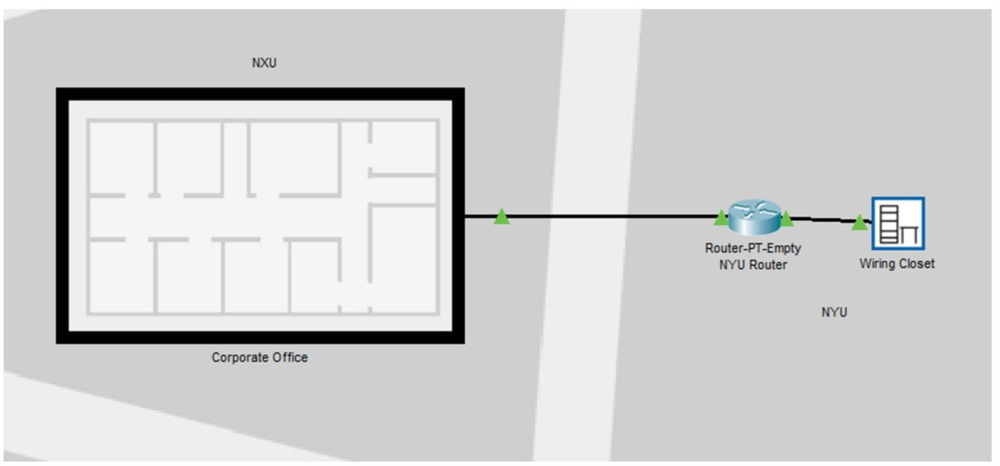
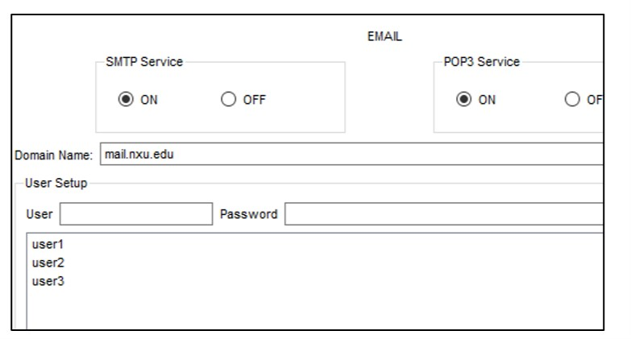
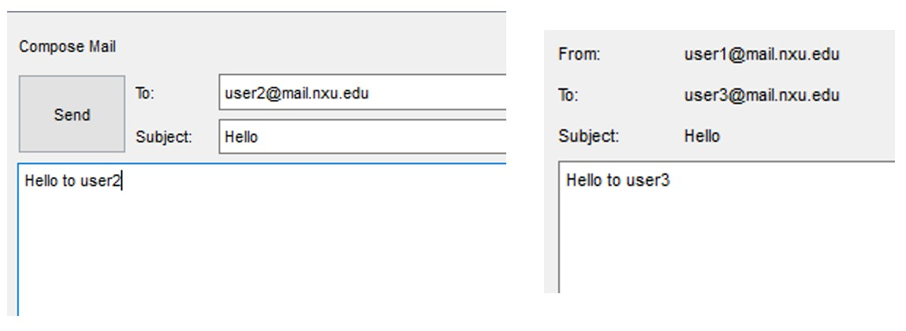
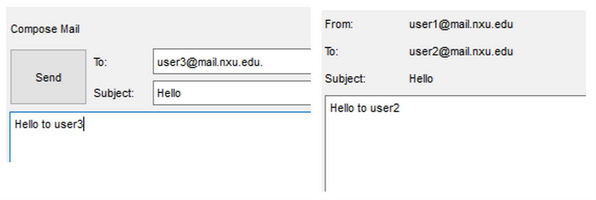
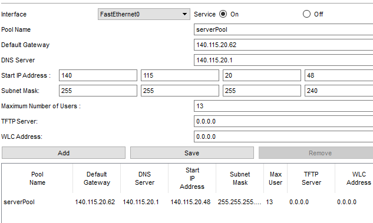
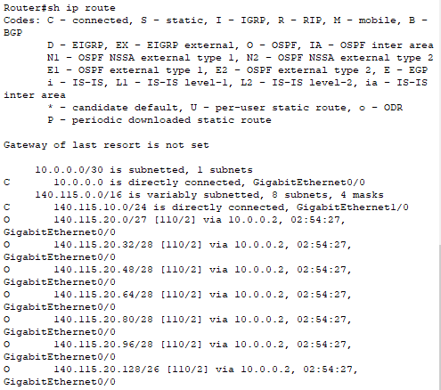

# CE3057-網路概論與實務 105503007 毛煥為 期末Project

## 專題名稱：模擬校園實驗室網路
## 服務目的：
* 模擬學校內單一系館樓層網路分布，樓層中有數間實驗室。
* 一個校區中有獨立DNS和郵件伺服器。
* 獨立建立Recursive DNS作為模擬與提供DNS分層查詢。
## 提供服務：
1. 各實驗室配有多於1台的個人電腦，配發實體IP，在各實驗室中另有一台伺服器作為DHCP伺服器分配各實驗室所能分配的IP區間。
2. 校園中DNS、Mail、無線網路DHCP伺服器皆集中在網路機房內統一管理，網路機房同時實驗室有配分配指定區間的實體IP。
3. 網路機房內有一路由器，利用子網路劃分方法限制特定介面卡分配特定區間的IP。(每間實驗室14個，網路機房有30個，無線網路有60個)
4. 在測試校園(NYU)中有建立Recursive DNS實際模擬現實生活中DNS分層，也提供目標校園(NXU)的DNS伺服器跟節點的查詢功能。
5. 測試區和目標區的路由器連接使用OSPF Routing協定。
6. 下圖右為NXU的實體網路拓譜圖，左圖為NYU的機櫃圖。

7. 下圖為本專題的邏輯網路拓譜圖，左區為目標拓譜區NXU，右區為測試及遞迴DNS區NYU。

8. 下圖為本專題的實體拓譜圖（城市視野）

## 各項服務（含路由器設計）：

1. Recursive DNS Servers：
    
    * Root節點：根節點設定指向下一層edu (TLD)
    * edu節點：TLD節點，指向NXU及NYU
2. NXU、NYU DNS Server：
    
    * 在DNS Server中輸入根節點，查詢由根結點開始。
    * 管理各校內部的域名轉址。
    * 提供郵件伺服器域名轉址服務和處理一般查詢。
3. Mail Server：
    
    * 在郵件伺服器中設定email address後面的郵件伺服器domain name和管理使用者。
    * 由NXU的User1(左)寄給NYU的User3(右)。
    
    * 由NXU的User1(左)寄給NXU的User2(右)。
    
4. DHCP Server：
    
    * 各實驗室與電腦教室利用DHCP分配IP減少IP設定時所需的成本。
5. WireLess Access Point：
   * 將AP的名稱設為相同，讓使用者可以不間斷使用無線網路。
   * 在AP網段中使用DHCP Server分配IP位址。

## IP分配與子網路切割：
1. NXU：使用140.115.20.0/24網段
    1. Lab A：140.115.20.32/28，140.115.20.33-.46，分配給5人使用。
    2. Lab B：140.115.20.48/28，140.115.20.49-.62，分配給5人使用。
    3. Lab C：140.115.20.80/28，140.115.20.81-.94，分配給5人使用。
    4. Lab D：140.115.20.96/28，140.115.20.97-.110，分配給5人使用。
    5. 網路機房：140.115.20.0/27，140.115.20.1-.30，分配給2人使用。
    6. 電腦教室：140.115.20.64/28，140.115.20.65-.78，分配給5人使用。
    7. 無線網路：140.115.20.128/26，140.115.20.129-.190，分配給5人使用。
   
2.	NYU(測試學校)：使用140.115.10.0/24網段
   * 140.115.10.80/24，140.115.20.1-.254，分配給4人使用，包含recursive dns。

3.	Router間使用10.0.0.0/30網段
   * 10.0.0.0/30，10.0.0.1和10.0.0.2，分別配發給2台Router，/30為了保障Router的網段沒有額外空間被他人利用。

## 網路拓譜使用媒介：
 1. 在Router和Router之間、Router和Switch之間使用光纖線連接，Router之間使用光纖線主要想表達若距離較遠使用光纖線是較好的選擇。兒語Switch之間使用光纖線是為了提升傳輸速度，也保留傳輸速度升級的空間。
 2. 而Switch到終端設備以雙絞線為使用媒介，因為有大量的需求，且對於終端傳輸量較無設備間大量，故在經濟與效率上使用雙絞線。

## 路由機制的規劃：
* 路由器之間使用Dynamic Routing 的OSPF機制，主要可以避免在在更動一台Router時需要連動去更新其他相連的Router。
下圖為NXU的routing狀況，可見NYU的140.115.10.0/24是透過OSPF協定完成的。

下圖為NXU的routing狀況，可見NXU的140.115.20.0/24是透過OSPF協定完成的。

